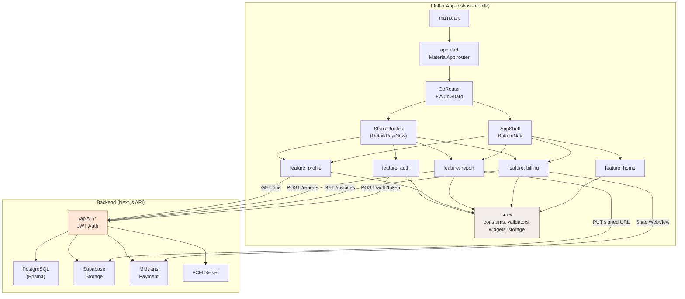
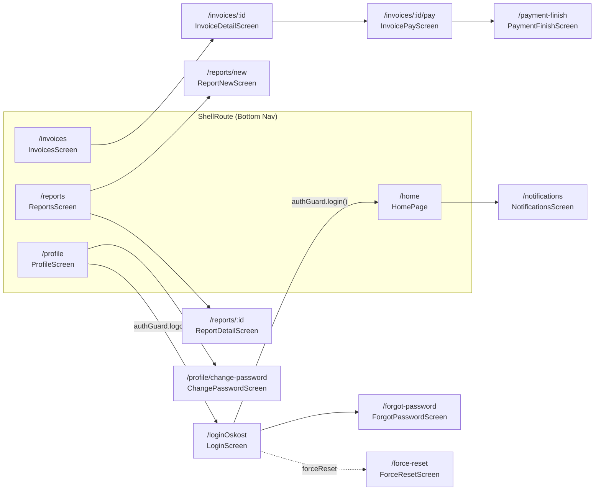
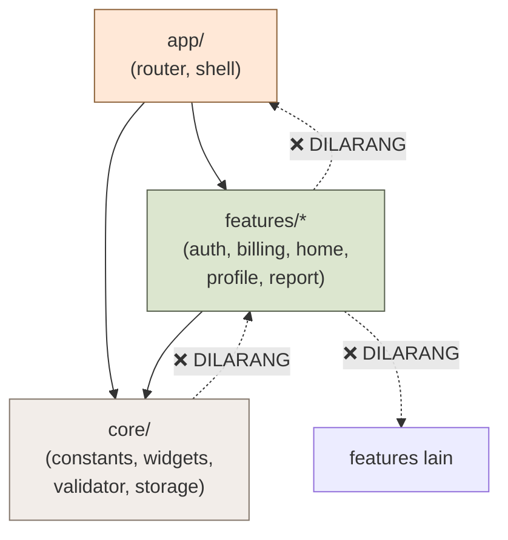
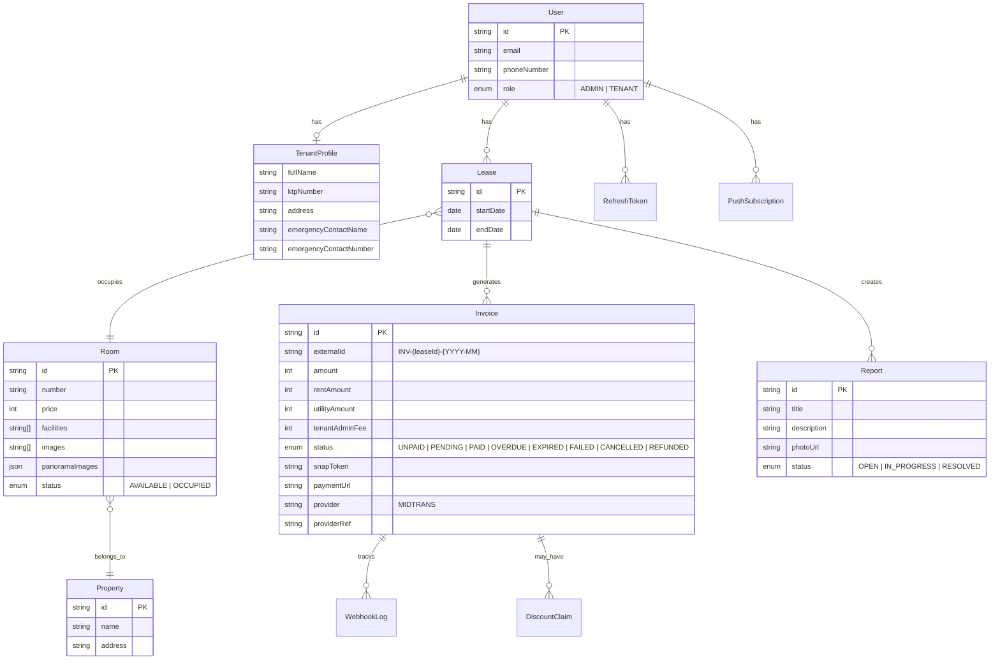
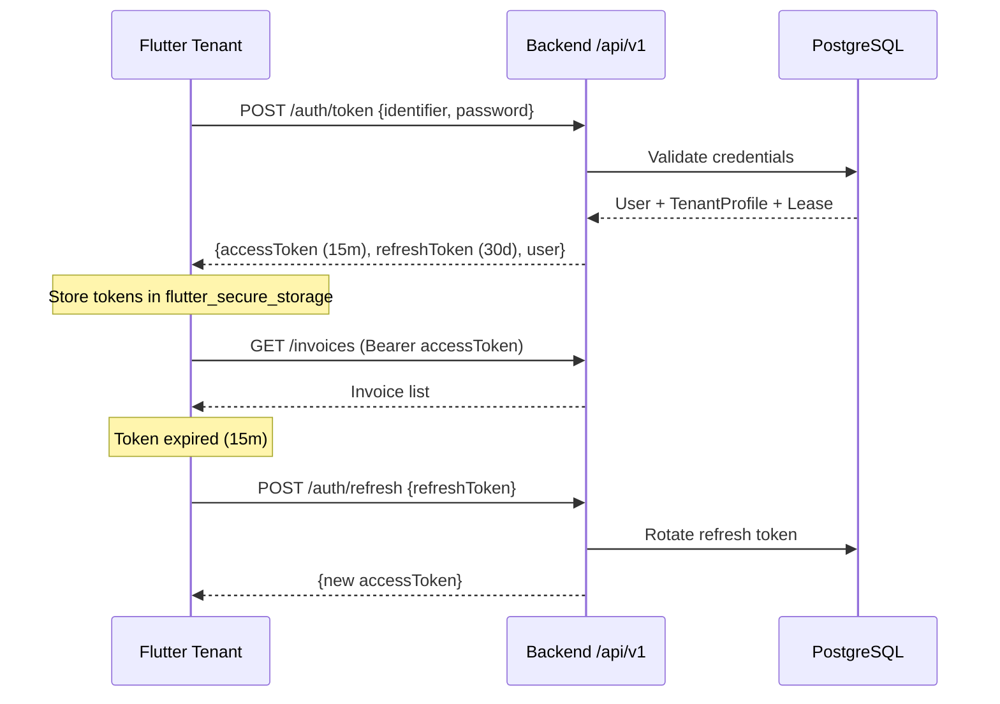

# Project Architecture Blueprint — OsKost Flutter Tenant (Mobile)

> **Versi**: 2.0.0 — Full Flutter Rewrite  
> **Terakhir Diperbarui**: 2026-09-18  
> **Dokumen Terkait**:
> [ARCHITECTURE_V2_MAPPING.md](file:///f:/BuildApps/oskost-mobile/docs/ARCHITECTURE_V2_MAPPING.md) •
> [design.md](file:///f:/BuildApps/oskost-mobile/docs/design.md) •
> [API-Contract-MVP.md](file:///f:/BuildApps/oskost-mobile/docs/engineering/API-Contract-MVP.md) •
> [Dokumentasi_Bisnis_Project_Oskost.md](file:///f:/BuildApps/oskost-mobile/docs/Dokumentasi_Bisnis_Project_Oskost.md) •
> [AI-Decisions.md](file:///f:/BuildApps/oskost-mobile/docs/Decisions/AI-Decisions.md)

---

## 1. Rangkuman Eksekutif

OsKost adalah sistem digital manajemen kost yang mendigitalisasi operasional Kost Pulo Jahe (3 lokasi, 11 pintu). **Repository ini (`oskost-mobile`)** merupakan **Flutter Tenant App** — aplikasi native Android/iOS khusus penghuni (tenant) yang menggantikan PWA Tenant dari v1.0.

Referensi topologi v2.0 dari [ARCHITECTURE_V2_MAPPING.md](file:///f:/BuildApps/oskost-mobile/docs/ARCHITECTURE_V2_MAPPING.md):

```
Web 2.0 (Next.js) ──┐
  Marketing + Admin  │  HTTPS /api/v1/* (JWT + Cookie)
  NO (pwaTenant)     ├─► Backend API (Next.js API Routes)
                     │     Prisma + Postgres + Supabase + Midtrans
Flutter (Dart) ──────┘
  Tenant only, FCM, Drift, Midtrans WebView
```

**Keputusan Kunci** (dari [AI-Decisions.md](file:///f:/BuildApps/oskost-mobile/docs/Decisions/AI-Decisions.md)):
- JWT baru untuk Flutter, cookie NextAuth tetap untuk web
- Backend tetap Next.js (Prisma/Midtrans/cron sudah production)
- PWA tenant dihapus di v2.0 untuk potong maintenance ganda

---

## 2. Deteksi Stack Teknologi Aktual

| Kategori | Teknologi | Versi |
|----------|-----------|-------|
| **Framework** | Flutter (Dart) | SDK ^3.13.1 |
| **Routing** | `go_router` + `go_router_builder` | ^18.0.1 / ^4.5.0 |
| **State Management** | `ChangeNotifier` (MVP) → *planned: Riverpod* | — |
| **Local Database** | `drift` + `sqflite` | ^2.35.0 / ^2.4.4 |
| **Key-Value Storage** | `shared_preferences` | ^2.5.5 |
| **Tipografi** | `google_fonts` (Noto Serif + Plus Jakarta Sans) | ^8.2.1 |
| **File Storage** | `path_provider` | ^2.1.6 |
| **UI Framework** | Material 3 (`useMaterial3: true`) | Built-in |
| **Testing** | `flutter_test` + `flutter_lints` | SDK / ^6.0.0 |

### Planned Dependencies (dari [ARCHITECTURE_V2_MAPPING.md](file:///f:/BuildApps/oskost-mobile/docs/ARCHITECTURE_V2_MAPPING.md))

| Kebutuhan | Pilihan |
|-----------|---------|
| HTTP Client | `dio` + `retrofit` |
| Secure Token Storage | `flutter_secure_storage` |
| State Management | `flutter_riverpod` |
| Offline Cache | `drift` (sudah installed) + `connectivity_plus` sync queue |
| Push Notifications | `firebase_messaging` + `flutter_local_notifications` |
| Payment Gateway | `webview_flutter` (load Midtrans Snap paymentUrl) |
| Photo Upload | `image_picker` + `flutter_image_compress` → WebP ≤500KB |
| Biometric Auth | `local_auth` (opsional) |

---

## 3. Pola Arsitektur

### 3.1 Feature-First Architecture (Modular Vertical Slices)

Arsitektur mengikuti pola **Feature-First** yang terinspirasi dari Clean Architecture, di mana setiap domain bisnis dienkapsulasi dalam modul terpisah di bawah `lib/features/`.

```
lib/
├── main.dart                          # Entry point
├── app/                               # Application Shell Layer
│   ├── app.dart                       # MaterialApp.router + ThemeData
│   ├── router/                        # Routing & Navigation
│   │   ├── app_router.dart            # GoRouter config + redirect logic
│   │   ├── auth_guard.dart            # ChangeNotifier auth state
│   │   └── route_paths.dart           # Centralized route constants
│   └── shell/
│       └── app_shell.dart             # Bottom NavigationBar shell
├── core/                              # Shared Infrastructure Layer
│   ├── constants/
│   │   └── app_colors.dart            # Wabi-Sabi design token (148 LOC)
│   ├── error/                         # (placeholder: error handling)
│   ├── storage/
│   │   └── local_storage.dart         # (placeholder: SharedPrefs wrapper)
│   ├── theme/                         # (placeholder: ThemeData builder)
│   ├── validator/
│   │   └── validator.dart             # Email/phone + password validation
│   └── widget/                        # Reusable UI Components
│       ├── card/
│       │   └── app_card_Payment.dart   # Payment summary card
│       ├── footer/
│       │   └── app_footer.dart         # App footer branding
│       ├── sheets/
│       │   └── app_pill.dart           # Glassmorphic pill badge
│       └── text_field/
│           ├── app_text_field.dart     # Configurable TextFormField
│           └── app_image_picker_field.dart  # (placeholder)
├── features/                          # Domain Feature Modules
│   ├── auth/                          # Autentikasi
│   ├── billing/                       # Tagihan & Pembayaran
│   ├── home/                          # Beranda Tenant
│   ├── profile/                       # Profil & Pengaturan
│   └── report/                        # Lapor Kerusakan
└── training/                          # Sandbox latihan (isolated)
    ├── mycontoh/
    └── storage/
```

### 3.2 Struktur Internal Feature Module

Setiap feature mengikuti pola internal yang konsisten:

```
features/<domain>/
├── model/                    # Data classes & enums
│   └── <entity>_item.dart    # Plain Dart model (immutable)
└── presentation/
    ├── providers/            # State management (ChangeNotifier/Riverpod)
    │   └── auth_provider.dart
    ├── screens/              # Full-page screen widgets
    │   ├── <feature>_screen.dart
    │   └── <detail>_screen.dart
    └── widgets/              # Feature-specific reusable widgets
        ├── <widget_a>.dart
        └── <widget_b>.dart
```

> [!NOTE]
> Layer `data/` (repository, data source, DTO) dan `domain/` (use case, entity) belum diimplementasikan.
> Saat ini masih MVP dengan dummy data. Akan ditambahkan saat integrasi API `/api/v1/*`.

---

## 4. Visualisasi Arsitektur

### 4.1 Diagram Arsitektur Tingkat Tinggi



### 4.2 Alur Navigasi (Route Map)



### 4.3 Dependency Flow (Aturan Impor)



**Aturan Dependensi**:
1. `app/` boleh mengimpor `features/` dan `core/`
2. `features/` boleh mengimpor `core/` saja
3. `core/` **TIDAK BOLEH** mengimpor `features/` atau `app/`
4. `features/X` **TIDAK BOLEH** mengimpor `features/Y` — jika butuh logic bersama, promosikan ke `core/`

---

## 5. Komponen Arsitektural Inti

### 5.1 Application Layer (`lib/app/`)

#### [`app.dart`](file:///f:/BuildApps/oskost-mobile/lib/app/app.dart) — Root Widget
- `MaterialApp.router` dengan `GoRouter` configuration
- Material 3 enabled (`useMaterial3: true`)
- Background: `#FEF8F5` (Wabi-Sabi warm linen)

#### [`app_router.dart`](file:///f:/BuildApps/oskost-mobile/lib/app/router/app_router.dart) — Centralized Routing
- **GoRouter** dengan `refreshListenable: authGuard`
- **Redirect Logic** multi-layer:
  - Training routes → selalu diizinkan
  - Payment deep-link → diizinkan tanpa auth (Midtrans redirect)
  - Force reset → wajib ganti password sebelum akses lain
  - Protected routes → redirect ke login jika belum auth
- **ShellRoute** untuk bottom navigation (4 tab)
- **Stack Routes** untuk detail/pay/new screens (di luar shell, dengan back)

#### [`auth_guard.dart`](file:///f:/BuildApps/oskost-mobile/lib/app/router/auth_guard.dart) — Auth State
- `ChangeNotifier`-based in-memory auth state
- Properties: `isLoggedIn`, `forceReset`
- Methods: `login()`, `logout()`, `requireForceReset()`, `clearForceReset()`
- Singleton global: `final authGuard = AuthGuard()`

> [!IMPORTANT]
> Saat ini guard masih in-memory (hilang saat restart app).
> **Upgrade path**: `flutter_secure_storage` + JWT refresh interceptor sesuai [API-Contract-MVP.md](file:///f:/BuildApps/oskost-mobile/docs/engineering/API-Contract-MVP.md).

#### [`app_shell.dart`](file:///f:/BuildApps/oskost-mobile/lib/app/shell/app_shell.dart) — Navigation Shell
- AppBar: Logo "OsKost" (Noto Serif) + Room pill badge + notification bell + avatar
- Bottom NavigationBar: 4 destinations (Beranda, Tagihan, Laporan, Profil)
- Location-based index detection via `GoRouterState.of(context).uri`

#### [`route_paths.dart`](file:///f:/BuildApps/oskost-mobile/lib/app/router/route_paths.dart) — Route Constants
```dart
abstract class RoutePaths {
  static const login          = '/loginOskost';
  static const home           = '/home';
  static const invoices       = '/invoices';
  static const reports        = '/reports';
  static const profile        = '/profile';
  static const reportNew      = '/reports/new';
  static const paymentFinish  = '/payment-finish';
  static const notifications  = '/notifications';
  // ... + helper methods: invoiceDetail(id), invoicePay(id), reportDetail(id)
}
```

---

### 5.2 Core Infrastructure Layer (`lib/core/`)

#### [`app_colors.dart`](file:///f:/BuildApps/oskost-mobile/lib/core/constants/app_colors.dart) — Design System Tokens

Implementasi lengkap design system **Wabi-Sabi Sanctuary** dari [design.md](file:///f:/BuildApps/oskost-mobile/docs/design.md):

| Kategori | Token | Hex | Deskripsi |
|----------|-------|-----|-----------|
| **Primary** | `primary` | `#714A23` | Unglazed Terracotta |
| | `primaryBrown` | `#8C6239` | Fired Earth (CTA utama) |
| | `primaryLight` | `#A67C52` | Warm Sandstone |
| **Secondary** | `secondaryGreen` | `#5D6654` | Koke Moss (success/nature) |
| | `secondaryContainer` | `#DCE6CF` | Moss tint surface |
| **Surface** | `background` | `#FEF8F5` | App background |
| | `backgroundLight` | `#F7F4EE` | Layer 0 canvas (warm linen) |
| | `surface` | `#FDFBF7` | Layer 1 highlight (washi) |
| | `surfaceCard` | `#EFECE6` | Layer 1 card (soft stone) |
| | `surfaceElevated` | `#FAF8F3` | Layer 2 modal/drawer |
| **Text** | `neutral` | `#2B2927` | Sumi ink primary text |
| | `textMuted` | `#68635D` | Wood smoke label |
| | `textTertiary` | `#948E85` | Stone grey inactive |
| **Status** | `warning` / `warningWash` | `#C27D38` / `#F5EBE1` | Belum Bayar / Pending |
| | `success` / `successWash` | `#5D6654` / `#EFF2EC` | Lunas / Aktif |
| | `error` | `#BA1A1A` | Error state |
| **Border** | `border` | `sumi 8%` | Whisper Border |
| **Glass** | `glassBar` | `linen 88%` | Blur overlay |
| **Shadow** | `elevation1`, `elevation2` | organic | Ultra-soft depth |

#### [`validator.dart`](file:///f:/BuildApps/oskost-mobile/lib/core/validator/validator.dart) — Input Validation
- `validateIdentity()`: Email format ATAU nomor WA Indonesia (`0/62/+62` prefix, min 10 digit)
- `validatePassword()`: Wajib diisi, minimal 6 karakter

#### Reusable Widgets (`core/widget/`)

| Widget | File | Fungsi |
|--------|------|--------|
| `AppCardPayment` | [`app_card_Payment.dart`](file:///f:/BuildApps/oskost-mobile/lib/core/widget/card/app_card_Payment.dart) | Card tagihan dengan badge status, nominal, jatuh tempo, tombol "Bayar Sekarang" |
| `AppFooter` | [`app_footer.dart`](file:///f:/BuildApps/oskost-mobile/lib/core/widget/footer/app_footer.dart) | Footer branding "OsKost Tenant Experience • Versi 2.0.0" |
| `AppPill` | [`app_pill.dart`](file:///f:/BuildApps/oskost-mobile/lib/core/widget/sheets/app_pill.dart) | Glassmorphic pill badge dengan backdrop blur |
| `AppTextField` | [`app_text_field.dart`](file:///f:/BuildApps/oskost-mobile/lib/core/widget/text_field/app_text_field.dart) | Configurable `TextFormField` dengan prefix/suffix, validation, dll |

---

### 5.3 Feature Modules (`lib/features/`)

#### 🔐 Auth (`features/auth/`)

| Screen | Route | Fungsi |
|--------|-------|--------|
| [`LoginScreen`](file:///f:/BuildApps/oskost-mobile/lib/features/auth/presentation/screens/login_screen.dart) | `/loginOskost` | Hero section + login form (email/phone + password) |
| [`ForgotPasswordScreen`](file:///f:/BuildApps/oskost-mobile/lib/features/auth/presentation/screens/forgot_password_screen.dart) | `/forgot-password` | Reset password via WA OTP |
| [`ForceResetScreen`](file:///f:/BuildApps/oskost-mobile/lib/features/auth/presentation/screens/force_reset_screen.dart) | `/force-reset` | Mandatory password change |

**Widget Terkait**: [`LoginForm`](file:///f:/BuildApps/oskost-mobile/lib/features/auth/presentation/widgets/login_form.dart) — Form login reusable

**Planned API Integration** ([API-Contract-MVP.md](file:///f:/BuildApps/oskost-mobile/docs/engineering/API-Contract-MVP.md)):
```
POST /api/v1/auth/token      → { accessToken, refreshToken, expiresIn, user }
POST /api/v1/auth/refresh     → { accessToken, expiresIn }
POST /api/v1/auth/logout      → revoke refresh token
```

---

#### 🏠 Home (`features/home/`)

| Screen | Route | Fungsi |
|--------|-------|--------|
| [`HomePage`](file:///f:/BuildApps/oskost-mobile/lib/features/home/presentation/screens/home_screen.dart) | `/home` | Dashboard tenant utama |
| [`NotificationsScreen`](file:///f:/BuildApps/oskost-mobile/lib/features/home/presentation/screens/notifications_screen.dart) | `/notifications` | List notifikasi |

**Widgets**:
- [`GreetingSection`](file:///f:/BuildApps/oskost-mobile/lib/features/home/presentation/widgets/greeting_section.dart) — "Selamat Pagi, {Nama}" editorial header
- [`RoomInfoCard`](file:///f:/BuildApps/oskost-mobile/lib/features/home/presentation/widgets/room_info_card.dart) — Info kamar tenant
- [`HomeHeroBanner`](file:///f:/BuildApps/oskost-mobile/lib/features/home/presentation/widgets/home_hero_banner.dart) — Banner visual utama
- [`ContractDurationCard`](file:///f:/BuildApps/oskost-mobile/lib/features/home/presentation/widgets/contract_duration_card.dart) — Durasi sewa (start-end date)
- [`QuickMenuGrid`](file:///f:/BuildApps/oskost-mobile/lib/features/home/presentation/widgets/quick_menu_grid.dart) — Grid menu cepat (8 item)

---

#### 💰 Billing (`features/billing/`)

| Screen | Route | Fungsi |
|--------|-------|--------|
| [`InvoicesScreen`](file:///f:/BuildApps/oskost-mobile/lib/features/billing/presentation/screens/invoices_screen.dart) | `/invoices` | List tagihan + filter status |
| [`InvoiceDetailScreen`](file:///f:/BuildApps/oskost-mobile/lib/features/billing/presentation/screens/invoice_detail_screen.dart) | `/invoices/:id` | Detail satu invoice |
| [`InvoicePayScreen`](file:///f:/BuildApps/oskost-mobile/lib/features/billing/presentation/screens/invoice_pay_screen.dart) | `/invoices/:id/pay` | Halaman pembayaran Midtrans |
| [`PaymentFinishScreen`](file:///f:/BuildApps/oskost-mobile/lib/features/billing/presentation/screens/payment_finish_screen.dart) | `/payment-finish` | Callback setelah Midtrans Snap |

**Planned API Integration**:
```
GET  /api/v1/invoices           → list invoices + pagination + filter
GET  /api/v1/invoices/:id       → detail invoice
POST /api/v1/invoices/:id/snap  → Snap Token + paymentUrl
```

**Payment Flow** (dari [AI-Decisions.md](file:///f:/BuildApps/oskost-mobile/docs/Decisions/AI-Decisions.md)):
1. Tenant tap "Bayar Sekarang"
2. Flutter → `POST /invoices/:id/snap` → get `snapToken` + `paymentUrl`
3. Open `webview_flutter` → load Midtrans Snap UI
4. Deep-link `oskost://payment-finish` → `PaymentFinishScreen`
5. Webhook Midtrans → server update `Invoice.status` → `PAID`

---

#### 🔧 Report (`features/report/`)

| Screen | Route | Fungsi |
|--------|-------|--------|
| [`ReportsScreen`](file:///f:/BuildApps/oskost-mobile/lib/features/report/presentation/screens/reports_screen.dart) | `/reports` | List laporan + CTA "Lapor Baru" |
| [`ReportNewScreen`](file:///f:/BuildApps/oskost-mobile/lib/features/report/presentation/screens/report_new_screen.dart) | `/reports/new` | Form laporan kerusakan baru |
| [`ReportDetailScreen`](file:///f:/BuildApps/oskost-mobile/lib/features/report/presentation/screens/report_detail_screen.dart) | `/reports/:id` | Detail + progress + resolusi |

**Model Data**: [`ReportItem`](file:///f:/BuildApps/oskost-mobile/lib/features/report/model/report_item.dart)
```dart
enum ReportStatus { open, resolved }

class ReportItem {
  final String id, category, title, description;
  final ReportStatus status;
  final DateTime reportedAt;
  final String? photoUrl, scheduleLabel;
  final double? progress;       // 0.0 - 1.0
  final String? resolvedByName, resolutionNote;
}
```

**Widgets** (15 widget — modul paling matang):

| Widget | Fungsi |
|--------|--------|
| `PageIntroHeader` | Eyebrow + title + description section |
| `PrimaryCtaButton` | Tombol aksi utama full-width |
| `StatusReportCard` | Card ringkasan status laporan |
| `ReportCard` | Card individual laporan |
| `AttachmentPhotoFrame` | Frame foto + badge "N Foto Terlampir" |
| `GuideInfoCard` | Card panduan cara melapor |
| `GuidePreviewCard` | Preview card panduan |
| `StatusBadge` | Badge status (Open/Resolved) |
| `StatRibbon` | Ribbon statistik |
| `ScheduleProgressTile` | Progress bar jadwal perbaikan |
| `ResolutionNoteTile` | Catatan penyelesaian |
| `ReportMetaFooter` | Footer metadata laporan |
| `SectionHeading` | Heading seksi |
| `EmergencyFooter` | Kontak darurat footer |
| `OskostAppBar` / `OskostBottomNav` | Custom navigation (isolated) |

**Planned Upload Flow** ([API-Contract-MVP.md](file:///f:/BuildApps/oskost-mobile/docs/engineering/API-Contract-MVP.md)):
1. `image_picker` → pilih foto dari kamera/galeri
2. `flutter_image_compress` → kompres ke WebP ≤ 500KB
3. `POST /reports/:id/photos` → get signed URL
4. `PUT` langsung ke Supabase Storage
5. Max 5 foto per report

---

#### 👤 Profile (`features/profile/`)

| Screen | Route | Fungsi |
|--------|-------|--------|
| [`ProfileScreen`](file:///f:/BuildApps/oskost-mobile/lib/features/profile/presentation/screens/profile_screen.dart) | `/profile` | Profil tenant + tombol logout |
| [`ChangePasswordScreen`](file:///f:/BuildApps/oskost-mobile/lib/features/profile/presentation/screens/change_password_screen.dart) | `/profile/change-password` | Ganti password |

**Planned API**: `GET /api/v1/me` → user + tenantProfile + activeLease + room + currentInvoice

---

## 6. Arsitektur Data

### 6.1 Domain Model (Backend — sumber kebenaran)

Dari [API-Contract-MVP.md](file:///f:/BuildApps/oskost-mobile/docs/engineering/API-Contract-MVP.md) dan [Dokumentasi Bisnis](file:///f:/BuildApps/oskost-mobile/docs/Dokumentasi_Bisnis_Project_Oskost.md):



### 6.2 Pola Akses Data di Flutter (Planned)

```
Screen → Provider/Cubit → Repository → DataSource
                                         ├── RemoteDataSource (Dio + JWT)
                                         └── LocalDataSource (Drift SQLite)
```

| Layer | Tanggung Jawab |
|-------|---------------|
| **Screen** | UI rendering, menerima state dari Provider |
| **Provider** | Business logic, state management, loading/error |
| **Repository** | Abstraksi sumber data, offline-first logic |
| **RemoteDataSource** | HTTP calls ke `/api/v1/*` via Dio + JWT interceptor |
| **LocalDataSource** | Cache data ke Drift (SQLite) untuk offline access |

### 6.3 Local Storage Strategy

| Data | Storage | Alasan |
|------|---------|--------|
| JWT Access Token | `flutter_secure_storage` | Encrypted, platform keychain |
| JWT Refresh Token | `flutter_secure_storage` | Sensitive, long-lived |
| User preferences | `shared_preferences` | Simple key-value |
| Invoice cache | `drift` (SQLite) | Structured, queryable offline |
| Report cache | `drift` (SQLite) | Structured, queryable offline |
| FCM token | `shared_preferences` | Non-sensitive device token |

---

## 7. Sistem Desain (Wabi-Sabi Sanctuary)

Dokumentasi lengkap: [design.md](file:///f:/BuildApps/oskost-mobile/docs/design.md)

### 7.1 Filosofi

> *Wabi-Sabi* (侘寂) — Estetika Jepang yang menghormati kesederhanaan, kehangatan, asimetri natural, dan craftsmanship tanpa pretensi. Kost sebagai **sanctuary** (tempat pulang dan istirahat) — bukan utilitas finansial yang mengintimidasi.

### 7.2 Tipografi

| Role | Font | Penggunaan |
|------|------|------------|
| **Editorial Voice** | `Noto Serif` | Sapaan, headline seksi, nama tenant |
| **Functional Voice** | `Plus Jakarta Sans` | Angka Rupiah, due date, navigasi, body |

### 7.3 Spacing System (Ma 間 — Negative Space)

| Token | Nilai | Penggunaan |
|-------|-------|------------|
| `space-xxs` | 4px | Micro gap |
| `space-xs` | 8px | Tight internal |
| `space-sm` | 12px | Card internal |
| `space-md` | 16px | Section internal |
| `space-lg` | 20px | Screen margin |
| `space-2xl` | 32px | Section separator |
| `screen-margin-mobile` | 20px | Outer horizontal padding |
| `bottom-nav-height` | 68px | Fixed bottom dock |

### 7.4 Elevation & Depth

| Layer | Surface | Contoh |
|-------|---------|--------|
| **0** (Canvas) | `#F7F4EE` warm linen | App background |
| **1** (Card) | `#EFECE6` soft stone | Card module |
| **1** (Highlight) | `#FDFBF7` washi paper | Elevated card |
| **2** (Float) | `#FAF8F3` + organic shadow | Modal, drawer |
| **Glass** | linen 88% + blur(16px) | Top bar, bottom nav |

### 7.5 Status Chips (dari [design.md](file:///f:/BuildApps/oskost-mobile/docs/design.md))

| Status | Background | Text | Indikator |
|--------|-----------|------|-----------|
| Belum Bayar / Pending | `#F5EBE1` ochre wash | `#9E5D26` | Sun/clock glyph |
| Lunas / Aktif | `#EFF2EC` moss tint | `#4D5745` | 6px moss dot |
| Error | `#FFDAD6` | `#93000A` | — |

---

## 8. Kontrak API (Backend ↔ Flutter)

Dokumentasi lengkap: [API-Contract-MVP.md](file:///f:/BuildApps/oskost-mobile/docs/engineering/API-Contract-MVP.md)

### 8.1 Konvensi Global

| Aspek | Konvensi |
|-------|---------|
| **Base URL** | `https://oskost.vercel.app/api/v1` |
| **Envelope** | `{ data, meta: { timestamp, requestId }, error: { code, message, details } }` |
| **Auth (Flutter)** | `Authorization: Bearer <accessToken>` (JWT 15 min + refresh 30d rotation) |
| **Error Codes** | `UNAUTHENTICATED(401)`, `FORBIDDEN(403)`, `VALIDATION_ERROR(400)`, `NOT_FOUND(404)`, `CONFLICT(409)`, `RATE_LIMITED(429)`, `INTERNAL_ERROR(500)` |
| **Versioning** | `/api/v1` stabil. Breaking → `/api/v2` |

### 8.2 Endpoint Summary

| Domain | Endpoint | Method |
|--------|----------|--------|
| Auth | `/auth/token` | POST |
| Auth | `/auth/refresh` | POST |
| Auth | `/auth/logout` | POST |
| Me | `/me` | GET |
| Billing | `/invoices` | GET |
| Billing | `/invoices/:id` | GET |
| Billing | `/invoices/:id/snap` | POST |
| Reports | `/reports` | GET, POST |
| Reports | `/reports/:id/photos` | POST |
| Push | `/push/subscriptions` | POST |

### 8.3 Aturan Upload Foto

- Client **wajib** kompres ke WebP ≤ 500KB (`flutter_image_compress`)
- MIME: `image/webp` only
- Max 5 foto per report
- Upload langsung ke Supabase via signed URL (PUT)

### 8.4 Idempotency & Keamanan

- `Invoice.externalId` = `INV-{leaseId}-{YYYY-MM}` → mencegah invoice ganda
- Midtrans `order_id` menggunakan suffix Base-36 timestamp untuk keunikan global (dari [AI-Decisions.md](file:///f:/BuildApps/oskost-mobile/docs/Decisions/AI-Decisions.md))
- Rate limit: login 5 req/menit/IP, snap 10 req/menit/user
- CORS: hanya origin `oskost.vercel.app` + `capacitor://localhost`

---

## 9. Cross-Cutting Concerns

### 9.1 Autentikasi & Autorisasi



### 9.2 Error Handling (Planned)

| Layer | Strategi |
|-------|---------|
| **Network** | Dio interceptor → catch `DioException` → map ke `AppError` |
| **Validation** | Zod-like validation di client (`validator.dart`) + server Zod |
| **UI** | Error state di Provider → tampilkan snackbar/dialog |
| **Offline** | `connectivity_plus` → queue actions → sync saat online |

### 9.3 Push Notifications (Planned)

Dari [ARCHITECTURE_V2_MAPPING.md](file:///f:/BuildApps/oskost-mobile/docs/ARCHITECTURE_V2_MAPPING.md):
- `firebase_messaging` + `flutter_local_notifications`
- Channel: `tagihan` (billing reminders), `pengumuman` (announcements)
- `POST /api/v1/push/subscriptions { platform: "android", token, deviceId }`

### 9.4 Offline-First Strategy (Planned)

```
Online:  API → Cache to Drift → Display
Offline: Drift cache → Display (read-only)
         Actions → Queue → Sync when online
```

---

## 10. Panduan Implementasi (Blueprint for New Development)

### 10.1 Menambahkan Feature Baru

```bash
# 1. Buat struktur folder
lib/features/new_feature/
├── model/
│   └── new_entity.dart           # Dart data class
├── data/                         # (saat API ready)
│   ├── datasources/
│   │   ├── new_remote_ds.dart    # Dio API calls
│   │   └── new_local_ds.dart     # Drift queries
│   ├── models/
│   │   └── new_dto.dart          # JSON serialization
│   └── repositories/
│       └── new_repo_impl.dart    # Repository implementation
├── domain/                       # (opsional untuk complex features)
│   ├── entities/
│   ├── repositories/
│   └── usecases/
└── presentation/
    ├── providers/
    │   └── new_provider.dart     # State management
    ├── screens/
    │   └── new_screen.dart       # Full-page screens
    └── widgets/
        └── new_widget.dart       # Feature-specific widgets

# 2. Tambahkan route di route_paths.dart
static const newFeature = '/new-feature';

# 3. Tambahkan GoRoute di app_router.dart
GoRoute(
  path: RoutePaths.newFeature,
  builder: (context, state) => const NewFeatureScreen(),
),

# 4. Jika perlu tab baru, update ShellRoute + AppShell
```

### 10.2 Pattern: Screen Widget

```dart
class FeatureScreen extends StatelessWidget {
  const FeatureScreen({super.key});

  @override
  Widget build(BuildContext context) {
    return SingleChildScrollView(
      child: Padding(
        padding: const EdgeInsets.all(20.0), // screen-margin-mobile
        child: Column(
          crossAxisAlignment: CrossAxisAlignment.start,
          children: [
            // Editorial header (Noto Serif)
            const PageIntroHeader(
              eyebrow: 'OVERLINE LABEL',
              title: 'Section Title',
              description: 'Deskripsi section...',
            ),
            const SizedBox(height: 24), // space-2xl
            // Content cards...
            const SizedBox(height: 16), // space-md
            const AppFooter(),
          ],
        ),
      ),
    );
  }
}
```

### 10.3 Pattern: Reusable Widget

```dart
class FeatureCard extends StatelessWidget {
  final String title;
  final VoidCallback? onTap;

  const FeatureCard({super.key, required this.title, this.onTap});

  @override
  Widget build(BuildContext context) {
    return Container(
      padding: const EdgeInsets.all(16),
      decoration: BoxDecoration(
        color: AppColors.surface,                    // Layer 1
        borderRadius: BorderRadius.circular(16),     // rounded-lg
        border: Border.all(color: AppColors.border), // whisper border
        boxShadow: AppColors.elevation1,             // organic shadow
      ),
      child: Text(title, style: GoogleFonts.plusJakartaSans(
        color: AppColors.neutral,
        fontSize: 14,
        fontWeight: FontWeight.w500,
      )),
    );
  }
}
```

### 10.4 Pattern: Integrasi API (Planned)

```dart
// 1. DTO (Data Transfer Object)
@JsonSerializable()
class InvoiceDto {
  final String id;
  final String externalId;
  final int amount;
  final String status;
  // fromJson / toJson
}

// 2. Remote DataSource
class InvoiceRemoteDataSource {
  final Dio _dio;
  
  Future<List<InvoiceDto>> getInvoices({int page = 1, String? status}) async {
    final response = await _dio.get('/invoices', queryParameters: {
      'page': page,
      if (status != null) 'status': status,
    });
    return (response.data['data'] as List)
        .map((e) => InvoiceDto.fromJson(e))
        .toList();
  }
}

// 3. Repository
class InvoiceRepository {
  final InvoiceRemoteDataSource _remote;
  final InvoiceLocalDataSource _local;
  
  Future<List<InvoiceDto>> getInvoices({required bool forceRefresh}) async {
    if (forceRefresh || !(await _hasCache())) {
      final data = await _remote.getInvoices();
      await _local.cacheInvoices(data);
      return data;
    }
    return _local.getCachedInvoices();
  }
}
```

---

## 11. Status Implementasi Aktual

| Modul | UI | Data Layer | API Integration | Status |
|-------|-----|-----------|----------------|--------|
| **Auth (Login)** | ✅ Lengkap | ❌ In-memory guard | ❌ Dummy | 🟡 MVP |
| **Auth (Forgot/Reset)** | ✅ Screen ada | ❌ | ❌ | 🟡 Placeholder |
| **Home** | ✅ Lengkap (5 widget) | ❌ Hardcoded | ❌ | 🟡 MVP |
| **Billing (List)** | 🟡 Scaffold only | ❌ | ❌ | 🔴 TODO |
| **Billing (Detail/Pay)** | 🟡 Screen ada | ❌ | ❌ | 🔴 TODO |
| **Report (List)** | ✅ Lengkap (15 widget) | ✅ `ReportItem` model | ❌ | 🟢 Most Complete |
| **Report (New/Detail)** | ✅ Screen ada | ✅ | ❌ | 🟡 MVP |
| **Profile** | 🟡 Scaffold only | ❌ | ❌ | 🔴 TODO |
| **Notifications** | 🟡 Screen ada | ❌ | ❌ | 🔴 TODO |
| **Payment (WebView)** | 🟡 Screen ada | ❌ | ❌ | 🔴 TODO |
| **Design System** | ✅ `AppColors` lengkap | — | — | 🟢 Done |
| **Routing** | ✅ Lengkap | — | — | 🟢 Done |
| **Core Widgets** | ✅ 4 widget | — | — | 🟢 Done |

---

## 12. Peta Migrasi (Dari v1.0 PWA ke v2.0 Flutter)

Dari [ARCHITECTURE_V2_MAPPING.md](file:///f:/BuildApps/oskost-mobile/docs/ARCHITECTURE_V2_MAPPING.md):

| Fase | Scope | Status |
|------|-------|--------|
| **Fase 0** | Backend: tambah `RefreshToken`, `platform`, endpoint token/refresh/me, dual-push sender | ⏳ |
| **Fase 1** | Flutter MVP: auth, tagihan+bayar, riwayat, laporan, profil, FCM | 🟡 In Progress |
| **Fase 2** | Web 2.0: hapus tenant PWA, redesign marketing + admin | ⏳ |
| **Fase 3** | Sunset PWA tenant: redirect + hapus SW tenant | ⏳ |

**Parity PWA yang harus dicapai Flutter**:
- [x] Login (UI done, API pending)
- [ ] Tagihan bulan ini + bayar (UI skeleton, API pending)
- [ ] Riwayat pembayaran
- [x] Lapor kerusakan + foto (UI done, API pending)
- [ ] Profil / ganti password (UI skeleton)
- [ ] Notifikasi (FCM)
- [ ] Offline cache
- [ ] Screen offline

---

## 13. Common Pitfalls & Best Practices

### ❌ Jangan

1. **Cross-feature imports** — Jangan impor `features/billing/` dari `features/report/`. Jika butuh shared logic, promosikan ke `core/`.
2. **Hardcode warna** — Selalu gunakan `AppColors.*` dari design system. Jangan pakai `Color(0xFF...)` langsung.
3. **Business logic di widget** — Logika bisnis harus di Provider/Cubit, bukan di `build()` method.
4. **Pass entire DB object ke widget** — Gunakan DTO/ViewModel yang hanya berisi field yang dibutuhkan.
5. **Image.asset + loadingBuilder** — `loadingBuilder` hanya untuk `Image.network`. Lihat catatan di kode [`attachment_photo_frame.dart`](file:///f:/BuildApps/oskost-mobile/lib/features/report/presentation/widgets/attachment_photo_frame.dart).

### ✅ Lakukan

1. **Gunakan `const` constructor** semaksimal mungkin untuk optimasi rebuild.
2. **Padding 20px** untuk screen margin (sesuai `screen-margin-mobile` design token).
3. **`GoogleFonts.notoSerif()`** untuk editorial text, **`GoogleFonts.plusJakartaSans()`** untuk functional text.
4. **`AppColors.elevation1`** / `elevation2` untuk shadow — jangan buat BoxShadow manual.
5. **Route via `RoutePaths.*`** — jangan hardcode string path.
6. **Validasi di client** menggunakan `validator.dart` SEBELUM kirim ke API.

---

## 14. Testing Strategy

| Level | Tool | Scope |
|-------|------|-------|
| **Unit Test** | `flutter_test` | Validators, models, providers |
| **Widget Test** | `flutter_test` | Individual widget rendering |
| **Integration Test** | `integration_test` | Full user flows (login → home → pay) |
| **E2E (Backend)** | Playwright | Landing page, auth flow (di web repo) |

File test yang ada: [`test/widget_test.dart`](file:///f:/BuildApps/oskost-mobile/test/widget_test.dart)

---

## 15. Deployment & Distribution

| Platform | Channel | Mekanisme |
|----------|---------|-----------|
| **Android** | Play Store | `flutter build appbundle` → Google Play Console |
| **iOS** | App Store | `flutter build ipa` → App Store Connect |
| **Backend** | Vercel | Auto-deploy dari git push |
| **Database** | Supabase | Managed PostgreSQL |
| **Storage** | Supabase Storage | Bucket: `Oskost-Data-Private`, `Oskost-Data-Public` |
| **Push** | Firebase Cloud Messaging | FCM (hanya push, bukan backend) |

---

## 16. Arsitektur Governance

| Aspek | Mekanisme |
|-------|-----------|
| **Linter** | `analysis_options.yaml` + `flutter_lints` ^6.0.0 |
| **Type Safety** | Dart strict mode |
| **Code Comments** | `// ponytail:` prefix untuk catatan migrasi/upgrade |
| **Decision Log** | [AI-Decisions.md](file:///f:/BuildApps/oskost-mobile/docs/Decisions/AI-Decisions.md) |
| **API Contract** | [API-Contract-MVP.md](file:///f:/BuildApps/oskost-mobile/docs/engineering/API-Contract-MVP.md) — perubahan wajib update versi |
| **Design System** | [design.md](file:///f:/BuildApps/oskost-mobile/docs/design.md) → [app_colors.dart](file:///f:/BuildApps/oskost-mobile/lib/core/constants/app_colors.dart) |

---

## 17. Dokumentasi Terkait (Index)

| Dokumen | Path | Status |
|---------|------|--------|
| Architecture V2 Mapping | [`docs/ARCHITECTURE_V2_MAPPING.md`](file:///f:/BuildApps/oskost-mobile/docs/ARCHITECTURE_V2_MAPPING.md) | ✅ Lengkap |
| Design System (Wabi-Sabi) | [`docs/design.md`](file:///f:/BuildApps/oskost-mobile/docs/design.md) | ✅ Lengkap |
| API Contract MVP | [`docs/engineering/API-Contract-MVP.md`](file:///f:/BuildApps/oskost-mobile/docs/engineering/API-Contract-MVP.md) | ✅ Lengkap |
| Business Requirements | [`docs/Dokumentasi_Bisnis_Project_Oskost.md`](file:///f:/BuildApps/oskost-mobile/docs/Dokumentasi_Bisnis_Project_Oskost.md) | ✅ Lengkap |
| BRD Summary | [`docs/Business/BRD.md`](file:///f:/BuildApps/oskost-mobile/docs/Business/BRD.md) | ✅ Lengkap |
| AI Decisions Log | [`docs/Decisions/AI-Decisions.md`](file:///f:/BuildApps/oskost-mobile/docs/Decisions/AI-Decisions.md) | ✅ Lengkap |
| Payment Gateway Plan | [`docs/AI/Plan/Panduan_Implementasi_Payment_Gateway_OsKost.md`](file:///f:/BuildApps/oskost-mobile/docs/AI/Plan/Panduan_Implementasi_Payment_Gateway_OsKost.md) | ✅ Lengkap |
| WA Gateway OTP Plan | [`docs/AI/Plan/wa-gateway-otp-plan.md`](file:///f:/BuildApps/oskost-mobile/docs/AI/Plan/wa-gateway-otp-plan.md) | ✅ Lengkap |
| Notification System Plan | [`docs/AI/Plan/Notification_System_Plan.md`](file:///f:/BuildApps/oskost-mobile/docs/AI/Plan/Notification_System_Plan.md) | ✅ Lengkap |
| PWA Architecture Ref | [`docs/AI/Plan/PWA_ARCHITECTURE_INSTRUCTIONS.md`](file:///f:/BuildApps/oskost-mobile/docs/AI/Plan/PWA_ARCHITECTURE_INSTRUCTIONS.md) | ✅ Referensi |
| Engineering Architecture | [`docs/engineering/Architecture.md`](file:///f:/BuildApps/oskost-mobile/docs/engineering/Architecture.md) | ❌ Kosong |
| Coding Standards | [`docs/engineering/CodingStandards.md`](file:///f:/BuildApps/oskost-mobile/docs/engineering/CodingStandards.md) | ❌ Kosong |
| Database Design | [`docs/engineering/DatabaseDesign.md`](file:///f:/BuildApps/oskost-mobile/docs/engineering/DatabaseDesign.md) | ❌ Kosong |
| Security | [`docs/engineering/Security.md`](file:///f:/BuildApps/oskost-mobile/docs/engineering/Security.md) | ❌ Kosong |
| API Spec | [`docs/engineering/API-Spec.md`](file:///f:/BuildApps/oskost-mobile/docs/engineering/API-Spec.md) | ❌ Kosong |
| Deployment | [`docs/engineering/Deployment.md`](file:///f:/BuildApps/oskost-mobile/docs/engineering/Deployment.md) | ❌ Kosong |
| Observability | [`docs/engineering/Observability.md`](file:///f:/BuildApps/oskost-mobile/docs/engineering/Observability.md) | ❌ Kosong |
| PRD | [`docs/Product/PRD.md`](file:///f:/BuildApps/oskost-mobile/docs/Product/PRD.md) | ❌ Kosong |
| User Flow | [`docs/Product/UserFlow.md`](file:///f:/BuildApps/oskost-mobile/docs/Product/UserFlow.md) | ❌ Kosong |
| Permission Matrix | [`docs/Product/PermissionMatrix.md`](file:///f:/BuildApps/oskost-mobile/docs/Product/PermissionMatrix.md) | ❌ Kosong |
| Wireframes | [`docs/Product/Wireframes.md`](file:///f:/BuildApps/oskost-mobile/docs/Product/Wireframes.md) | ❌ Kosong |
| KPI | [`docs/Business/KPI.md`](file:///f:/BuildApps/oskost-mobile/docs/Business/KPI.md) | ❌ Kosong |

---

*Updated: 2026-09-18 (Full Flutter Architecture Blueprint v2.0)*
